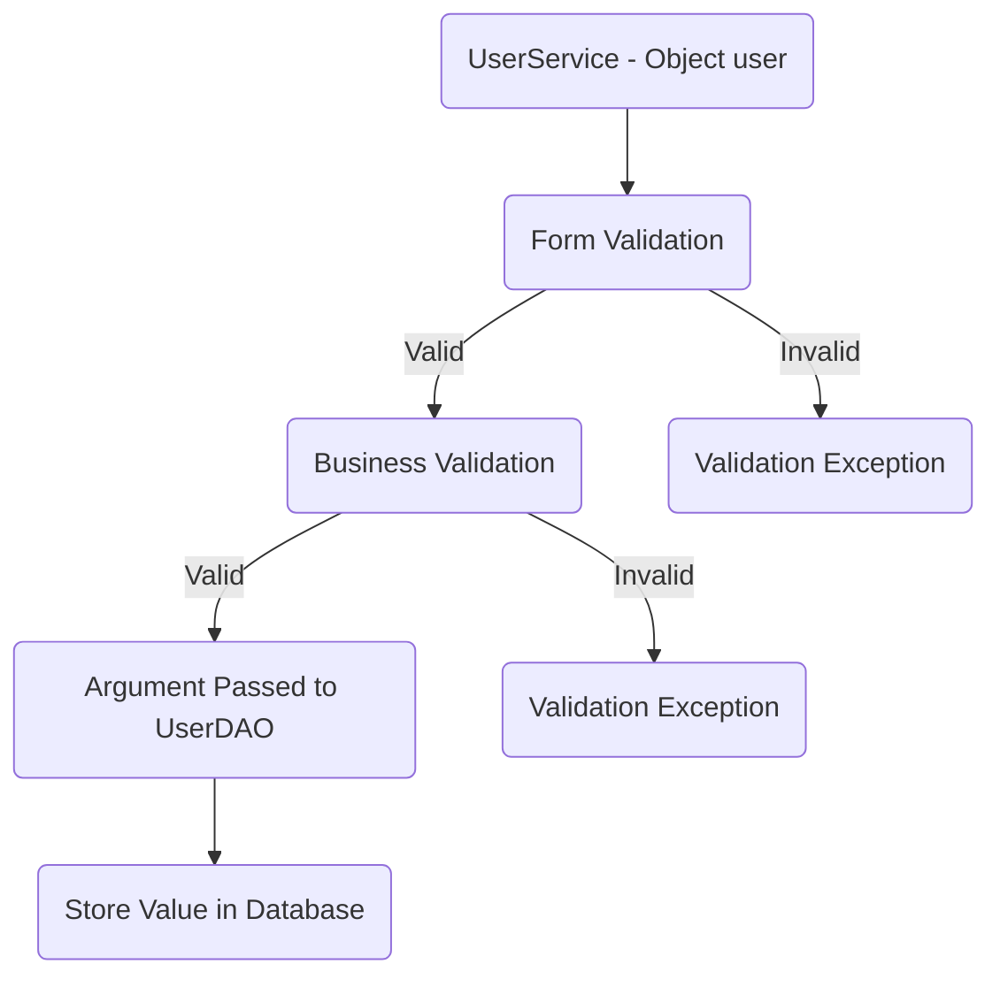
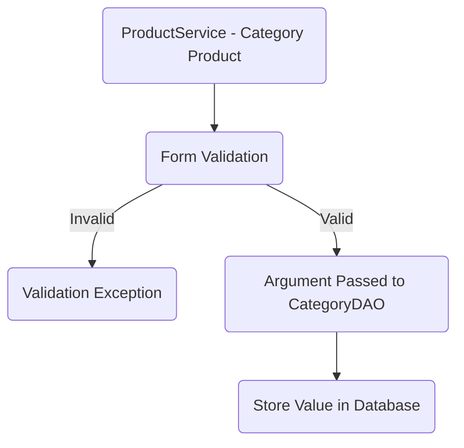
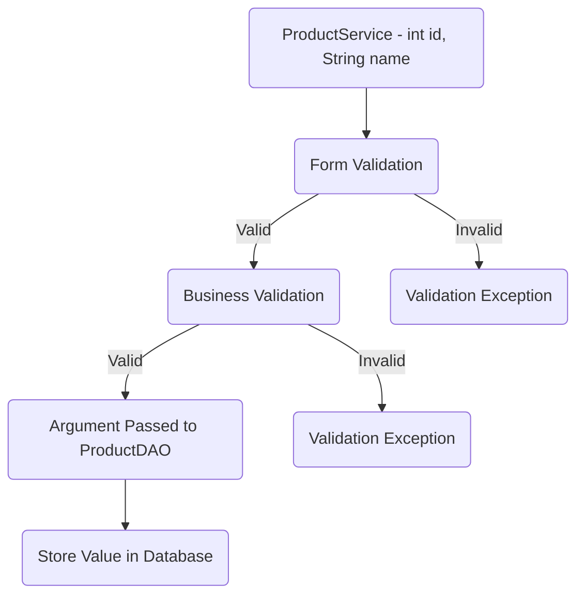
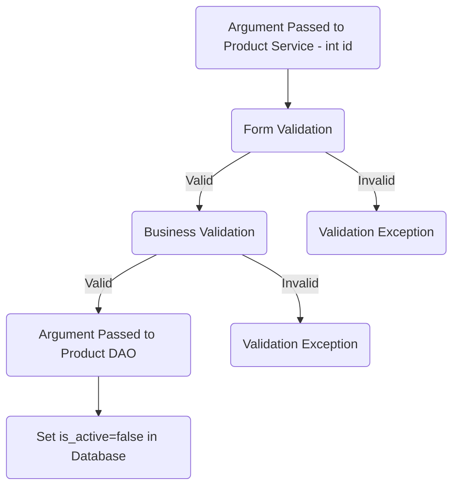
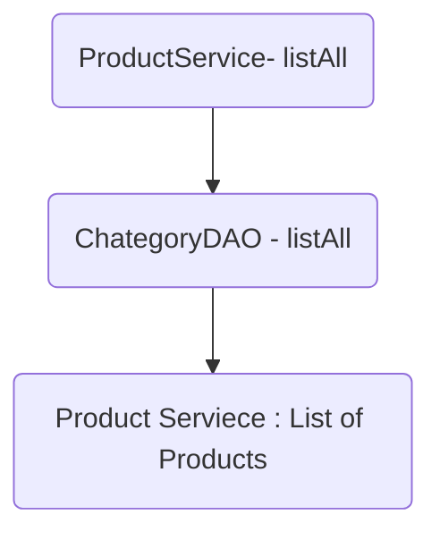
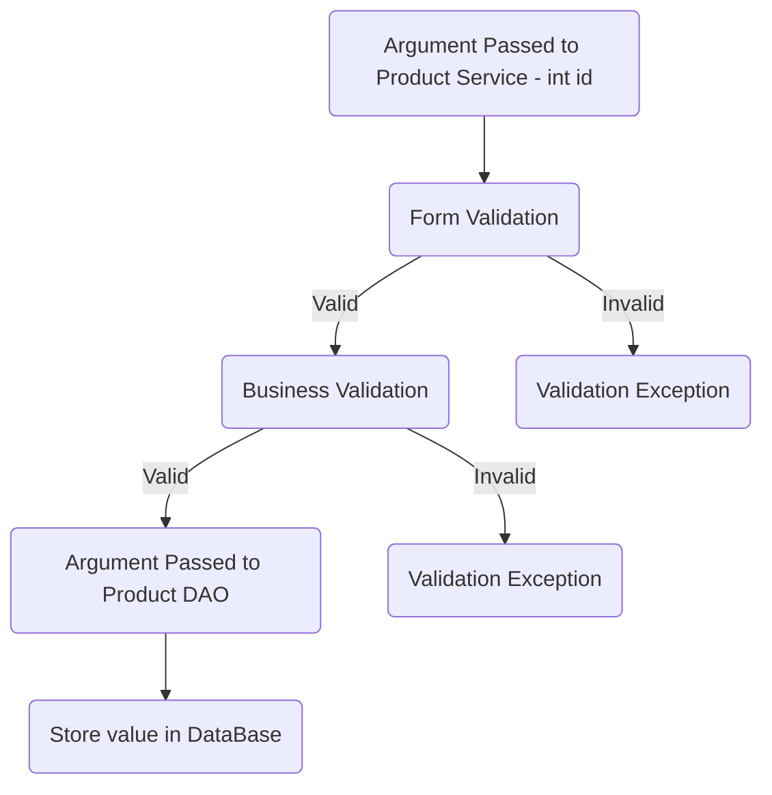

# Kaithari

## Database Design

- [ ] Create an ER diagram of the database  
- [ ] Write Create table scripts [script]

)
## Project Setup

- [ ] Create a new Java project  
- [ ] Set up a MySQL database  
- [ ] Add necessary libraries  
- [ ] JDBC,  
- [ ] MySQL Connector,  
- [ ] JUnit,  
- [ ] Dotenv

## Module 1: User

* Attributes  
	* int userId  
	* String firstName
	* String lastName   
	* String email  
	* String password  

### Feature 1 : Create User

### User story :  

> User created successfully and the user details will be stored in database.

### Pre-requisites:
- [ ] user table  
- [ ] user model  
- [ ] user DAO (Create) 
- [ ] user service ( create )

#### Validations:

- [ ] Form validator  
	* user ( null )  
	* firstName ( null, empty, pattern )  
	* lastName ( null, empty, pattern ) 
	* email ( null, empty, pattern )  
	* password ( null, empty, pattern )  
- [ ] Business Validation  
	* Email Already exists

#### Messages:

* User object cannot be null  
* Name cannot be null or empty  
* Name should be match with the given pattern  
* Email cannot be null or empty  
* Email Should be match with the given pattern  
* Password cannot be null or empty  
* Password must contains at least 8 characters  
* Password should be match with the given pattern  
* User already exists

#### Flow:  
> Invalid When a user's email is already in use or when the input provided does not meet the criteria, users arise.

### Feature 2 : Update User

### User story :  
> User details successfully updated and stored in database.

### Pre-requisites:
- [ ] completed feature 1 - create user  
- [ ] user dao ( update )  
- [ ] user service ( update )

#### Validations:

- [ ] Form validator  
	* userId (less than or equal to 0)  
	* firstName ( null, empty, pattern )  
	* lastName ( null, empty, pattern ) 
	* password (null , empty, pattern )
	*  email(null , empty, pattern )
- [ ] Business Validation  
	* Check whether the userId exist

#### Messages:

* userId cannot be 0 or in negative  
* Name cannot be null or empty  
* Name should be match with the given pattern  
* Password cannot be null or empty  
* Password must contains at least 8 characters  
* Password should match with the given pattern  
* Email cannot be null or empty  
* Email Should be match with the given pattern 
* User not found

#### Flow:  
> Invalid When a user's  email is not in use or when the input provided does not meet the criteria, users arise.

## Module: Product
   Attributes
   * int productId
   * String name
   * String description
   * int  categoryId
   * int  productPrice
   
### Feature 1: Create Product

#### User Story:
> Product created Successfully and the user details will be stored in database.

#### Pre-requisites:
- [ ] Create Category table
- [ ] Category model
- [ ] Category DAO(findAll ,findById)
- [ ] Category service(findAll ,findById)
- [ ] Create product table
- [ ] product model
- [ ] product DAO(create)
- [ ]  Product Service( create )

#### Validations:
- [ ] Form Validation
* Product( null or empty )
* Name (null, empty, pattern)
* Description (null, empty)
* Price <= 0

#### Messages:
* Product object Can not be null
* Name can not be null or empty
* Description can not be null or empty
* price cannot be zero or negetive

#### Flow:  
> Invalid When a category's name is already in use or when the input provided does not meet the criteria, categories arise.

  
### Feature  3: Update Product

### User story :

 > Products deatils are successfully updated and stored in databse.

### Pre-requisites 

- [ ] complete feature 1- create product
- [ ] Category model
- [ ] Category DAO(findAll,findById)
- [ ] Category service(findAll,findById)
- [ ] product table
- [ ] product DAO (update)
- [ ] product service ( update )

#### Validations:  

- [ ] Form Validation 
   * product null or empty
    * categoryId <= 0
    * price <=0
    * name ( null, empty, pattern )  
	* description ( null, empty )

- [ ] Business Validation
	* Check whether the Category ID is available in the Category table. 
	* Check whether the Category exists.
	* check whetehr the productId exists or not

#### Messages:  

* invalid categoryId
* invalid product object
* price cannot be zero or negetive
* Name cannot be null or empty
* Name should be match with the given pattern 
* Description cannot be null or empty 
* categoryId is not available
* productId does not exists.

#### Flow:  

> Invalid When a Product's name is not in use or when the input provided does not meet the criteria, categories arise.

  
### Feature 4 : Delete Product

### User story :

> The product will be deleted from database.

### Pre-requisites:
- [ ] complete feature 1 - create Product
- [ ] Product dao ( delete )
- [ ] Product service ( delete )

#### Validations:  

- [ ] Form Validation 
	* productId <= 0 

- [ ]  Business Validation  
	* Check whether theproductId  exists in the product Table

#### Messages:

* invalid productId
* productId is not found

#### Flow:  

> Invalid When a Product's name is not in use or when the input provided does not meet the criteria, categories arise.

### Feature 2: List all products
 
#### User Story:

> List all Products stored in the database.

#### Pre-requisites:
- [ ] complete feature 1- create Product
- [ ] Category model
- [ ] Category DAO(findAll,findById)
- [ ] Category service(findAll,findById)
 - [ ] Product table
- [ ] Product model
- [ ] Product DAO(list all products)
- [ ] Product service ( list all products)

#### Flow:

### Feature: List all the Products By Category Id

#### User Story:
> User will get all the products by category_id.

#### Pre-requisites:
- [ ] Category table
- [ ] Category model
- [ ] Category DAO(findAll,findById)
- [ ] Category service(findAll,findById)
- [ ] Product table
- [ ] Product model
- [ ] Product DAO( find All Products By Category Id)
- [ ] Product service ( find All Products By Category Id)

#### Validations:
- [ ] Form Validation
  * categoryId <= 0 
- [ ] Business Validation 
  * check whether the CategoryId  is available in the category table
  
#### Messages:
   * invalid categoryId
   * CategoryId  does not exists

#### Flow:

